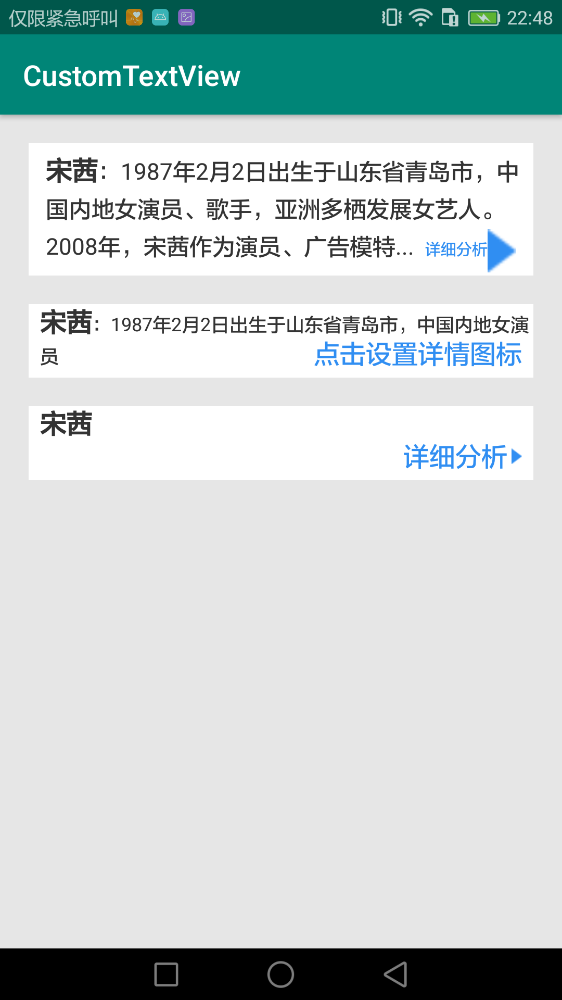

# CustomTextView
[](https://jitpack.io/#yangsanning/CustomTextView)
[](https://android-arsenal.com/api?level=19)

## 效果预览
###### 点击可查看相应view配置

| [LabelEllipsisTextView] | [MagicalTextView]    | [RCTextView]       | [SpaceTextView]|
| ----------------------- | ----------------------- | ---------------- | ------------- |
| [][LabelEllipsisTextView] | [][MagicalTextView] | [][RCTextView] | [][SpaceTextView] |


## 主要文件
| 名字             | 摘要           |
| ---------------- | -------------- |
|[LabelEllipsisTextView] | 前后加标识的view, 中间进行缩略  |
|[MagicalTextView]  | 头部、内容、末尾样式都不一样的view  |
|[RCTextView] | 圆角view, 可点击，可设置图标|
|[SpaceTextView] | 可调整字间距的 TextView |


## 添加方法

### 添加仓库

在项目的 `build.gradle` 文件中配置仓库地址。

```android
allprojects {
	repositories {
		...
		maven { url 'https://jitpack.io' }
	}
}
```

#### 添加项目依赖

在需要添加依赖的 Module 下添加以下信息，使用方式和普通的远程仓库一样。

```android
implementation 'com.github.yangsanning:CustomTextView:1.1.0'
```


[LabelEllipsisTextView]: https://github.com/yangsanning/CustomTextView/blob/master/textview/src/main/java/ysn/com/textview/LabelEllipsisTextView.java
[MagicalTextView]: https://github.com/yangsanning/MagicalTextView
[RCTextView]: https://github.com/yangsanning/CustomTextView/blob/master/textview/src/main/java/ysn/com/textview/RCTextView.java
[SpaceTextView ]: https://github.com/yangsanning/CustomTextView/blob/master/textview/src/main/java/ysn/com/textview/SpaceTextView.java

